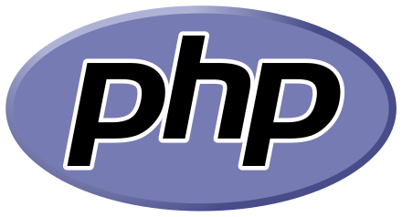

# About Me

I am a Filipino student who plans to to dive into the programming world and learn various programming languages.

As I set upon this tiring yet fun journey of improving my capabilities on the programming world, I plan to share my
works and contribution to inspire, if not, showcase all I have achieved throughout my whole learning sessions.

## What Programming Languages I Use
<DOCTYPE html>
<html>
  <header>
    <header style="text-align:center">PHP Language</header>
  </header>
  <body>
    
  </body>
</html>
<html>
  <header>
    <header style="text-align:center">Python Language</header>
  </header>
  <body>
    
  </body>
</html>
